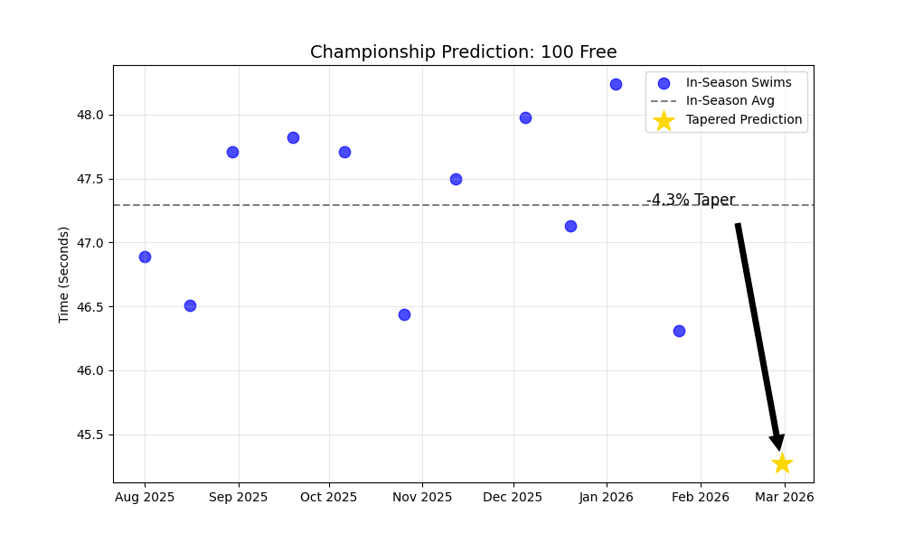

# Swimming Data Analytics

I built this project to bring data science into swim training. The goal is to move beyond just looking at "best times" and visualize how training, fatigue, and tapering affect performance throughout the season.

Right now, it uses a simulation engine to generate realistic seasons because scraping live data is difficult to do reliably, but the math and logic are ready for real world application.

## What It Does

### Season Split Normalization
Comparing Short Course (Winter) times to Long Course (Summer) times is difficult because the courses are different. I built a normalizer that visualizes them as distinct training blocks so you can see year-round progression without the data being skewed.

### Taper Prediction
I wrote a script that calculates a "Taper Coefficient" based on historical drops (the difference between in-season fatigue and championship rest). It applies this coefficient to current season data to predict final times for the Ivy League Championships.

### Record Tracking
The system flags records that are "stale" (over 2 years old) versus "fresh" (under 6 months). This helps prioritize which events need more focus during training blocks.

## Future Directions
This project is still in development. Here is what I am working on next:

* **Real Data Integration:** I am currently testing the models on simulated data. The next step is finishing the Playwright scraper to pull live meet results from SwimCloud.
* **Custom SCY/LCM Conversions:** Instead of using a generic conversion factor, I want to analyze each specific swimmer's history to find their personal conversion ratio.
* **Event-Specific Taper Analysis:** Taper affects a sprinter differently than a distance swimmer. I plan to automate the analysis to produce unique drop curves for every event rather than applying one rule to everything.

## Tech Stack
* **Python** for the core logic.
* **Pandas & NumPy** for time-series data manipulation.
* **Matplotlib** for generating the charts.
* **Playwright** for web scraping. (in progress)

---
Created by Thai Koehnle
